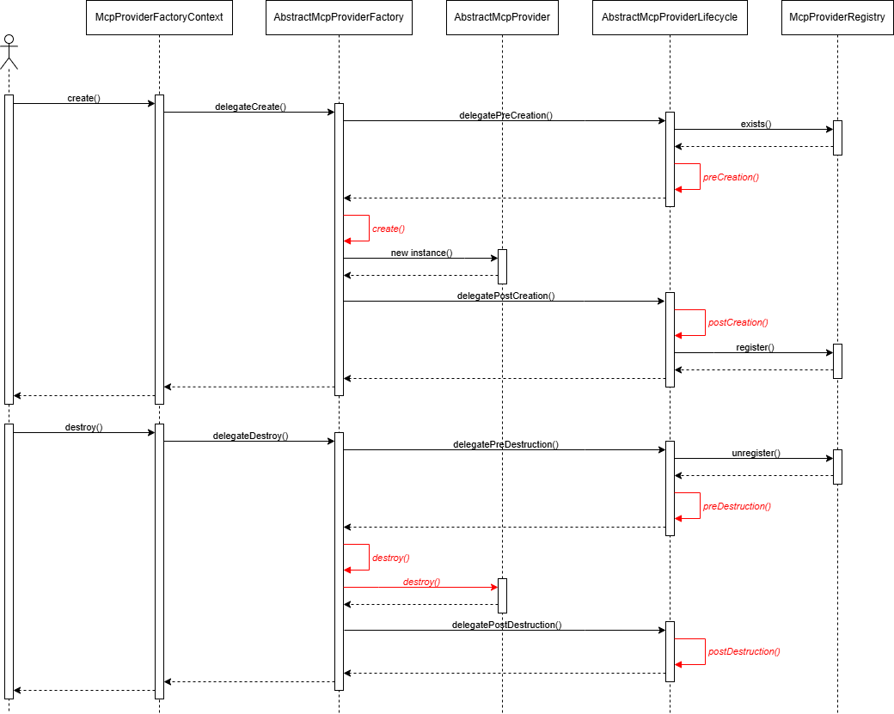

# Multi-Cache Provider Interface Service

## *Multi-Cache Provider(MCP) `🚀️ V1.0.0`*

### 📚 Dependency

Please refer to `dependencies-control-center` for the version number.

| groupId                  | artifactId                          | scope    |
|--------------------------|-------------------------------------|----------|
| org.springframework.boot | spring-boot-starter-web             | compile  |
| org.springframework.boot | spring-boot-starter-actuator        | compile  |
| org.springframework.boot | spring-boot-starter-data-redis      | compile  |
| org.springframework.boot | spring-boot-starter-data-mongodb    | compile  |
| org.springframework.boot | spring-boot-starter-data-jpa        | compile  |
| org.springframework.boot | spring-boot-starter-validation      | compile  |
| org.springdoc            | springdoc-openapi-starter-webmvc-ui | compile  |
| com.mysql                | mysql-connector-j                   | compile  |
| redis.clients            | jedis                               | compile  |
| ricciliao.x              | components-starter                  | compile  |
| ricciliao.x              | mcp-common-component                | compile  |
| jakarta.servlet          | jakarta.servlet-api                 | provided |
| org.springframework.boot | jakarta.servlet-api                 | test     |

### 📌 Usage

**Multi-Cache Provider**(MCP) provides RESTful interfaces for MongoDB and Redis,
you can choose MongoDB or Redis as cache provider(s) for your data,
also, you can use more than one provider(s) at the same times if you need to cache dataA into MongoDB and dataB into
Redis,
and don’t worry about the implement, just define it and use it!

### 📝Configuration

The MCP include custom starter(s) which base on spring starter, you can config the provider(s) properties
in
your `application.yml`
and the starter will auto define provider(s) by your properties when your app start up.

```yaml
mcp:
  redis:
    host:
    port:
    username:
    password:
  mongo:
    jks:
      path:
      password:
    host:
    port:
    username:
    password:
    authentication-database: 
```

#### ❓*What happens when the application launches?*



**Each provider(s) has its own Factory and Lifecycle implement!**

### 📝 CURD Interface

* #### 🎯 Interface

    * *POST* `/operation`
      Create a new record for the consumer(with identifier).
    * *PUT* `/operation`
      Update a existed record for the consumer(with identifier).
    * *DELETE* `/operation/{id}`
      Delete a existed record for the consumer(with identifier).
    * *GET* `/operation/{id}`
      Retrieve a existed record for the consumer(with identifier).
    * *POST* `/operation/batch`
      Batch create new records for the consumer(with identifier).
    * *PUT* `/operation/batch`
      Batch update existed records for the consumer(with identifier).
    * *POST* `/operation/list`
      Retrieve list of existed record for the consumer(with identifier).
    * *GET* `/operation/extra/info`
      Retrieve provider information for the consumer(with identifier).

---

1.
    * *POST* `/operation`
    * *PUT* `/operation`
    * *POST* `/operation/batch`
    * *PUT* `/operation/batch`
      

2.
    * *GET* `/operation/{id}`
    * *POST* `/operation/list`
      

* #### 📝 Code

#### 🐾 Common

*Please refer to `x-mcp-components`*

* #### McpCache.class

```java
public class McpCache<T extends Serializable> implements Serializable {
    @McpCriteria.Support(McpCriteria.Property.ID)
    private String uid;
    @McpCriteria.Support(McpCriteria.Property.CREATED_DTM)
    private Instant createdDtm;
    @McpCriteria.Support(McpCriteria.Property.UPDATED_DTM)
    private Instant updatedDtm;
    @McpCriteria.Support(McpCriteria.Property.TTL)
    private Instant ttlEffectedDtm;
    @Data
    private T data;
}
```

Definition of data structure which stored in MCP.

---

* #### McpIdentifier.class

```java
public class McpIdentifier implements Serializable {
    private String consumer;
    private String store;
}
```

The identification of cache data.

---

* #### McpProviderInfo.class

```java
public class McpProviderInfo implements PayloadData {
    private Long count;
    private Instant createdDtm;
    private Instant maxUpdatedDtm;
    private McpIdentifier mcpIdentifier;
}
```

You can retrieve provider information.

---

#### 📀 Provider

* #### ProviderCache.class

```java
public class ProviderCache extends McpCache<byte[]> {
}
```

Definition of provider data structure which stored in MCP.

---

* #### AbstractProviderCacheMessage.class

```java
public abstract class AbstractProviderCacheMessage<T extends Serializable> implements Serializable {
    private T data;

    public static Single of(ProviderCache cache) {
        return new Single(cache);
    }

    public static Batch of(ProviderCache[] cache) {
        return new Batch(cache);
    }

    public static class Single extends AbstractProviderCacheMessage<ProviderCache> {
    }

    public static class Batch extends AbstractProviderCacheMessage<ProviderCache[]> {
    }
}
```

Definition of provider operation payload, you can use this to manipulate single or batch data(s).

---

* #### AbstractMcpCacheMessageConverter.class

```java
public abstract class AbstractMcpCacheMessageConverter<T extends AbstractProviderCacheMessage<? extends Serializable>> extends AbstractHttpMessageConverter<T> {
    protected final ObjectMapper objectMapper;
    private final McpProviderRegistry mcpProviderRegistry;
    private final ResponseHttpMessageConverter responseHttpMessageConverter;

    protected AbstractMcpCacheMessageConverter(ObjectMapper objectMapper, McpProviderRegistry mcpProviderRegistry) {
        super(MediaType.APPLICATION_JSON);
        this.objectMapper = objectMapper;
        this.mcpProviderRegistry = mcpProviderRegistry;
        this.responseHttpMessageConverter = new ResponseHttpMessageConverter(objectMapper);
    }

    protected AbstractMcpProvider verify(HttpInputMessage inputMessage) throws ParameterException {
        List<String> customer = inputMessage.getHeaders().get(McpConstants.HTTP_HEADER_FOR_CACHE_CUSTOMER);
        List<String> store = inputMessage.getHeaders().get(McpConstants.HTTP_HEADER_FOR_CACHE_STORE);
        if (CollectionUtils.isEmpty(customer) || customer.size() > 1
                || CollectionUtils.isEmpty(store) || store.size() > 1) {
            throw new ParameterException(SecondaryCodeEnum.BLANK);
        }
        McpIdentifier identifier = new McpIdentifier(customer.getFirst(), store.getFirst());
        if (!Boolean.TRUE.equals(mcpProviderRegistry.exists(identifier))) {
            throw new ParameterException(SecondaryCodeEnum.BLANK);
        }
        return mcpProviderRegistry.get(identifier);
    }

    protected ProviderCache encode(JsonNode jsonNode, AbstractMcpProvider cacheProvider) throws JsonProcessingException {
        McpCache<Serializable> cache = objectMapper.convertValue(jsonNode, new TypeReference<>() {
        });
        cache.setData(objectMapper.writeValueAsBytes(cache.getData()));
        Instant now = Instant.now();
        if (jsonNode.hasNonNull("ttlSec")) {
            long ttlDiff = jsonNode.get("ttlSec").asLong() - cacheProvider.getTtlSeconds().getSeconds();
            cache.setTtlEffectedDtm(now.plusSeconds(ttlDiff));
        } else {
            cache.setTtlEffectedDtm(now);
        }
        return objectMapper.convertValue(cache, new TypeReference<>() {
        });
    }

    protected McpCacheMap decode(ProviderCache cache) throws IOException {
        byte[] data = cache.getData();
        cache.setData(null);
        McpCacheMap result = objectMapper.convertValue(cache, new TypeReference<>() {
        });
        result.setData(objectMapper.readValue(data, new TypeReference<>() {
        }));
        return result;
    }

    @Nonnull
    @Override
    protected final T readInternal(@Nonnull Class<? extends T> clazz, @Nonnull HttpInputMessage inputMessage) throws HttpMessageNotReadableException {
        try {
            return this.readInternal(objectMapper.readTree(inputMessage.getBody()), this.verify(inputMessage));
        } catch (Exception e) {
            throw new HttpMessageNotReadableException(e.getMessage(), inputMessage);
        }
    }

    @Override
    protected final void writeInternal(@Nonnull T t, @Nonnull HttpOutputMessage outputMessage) throws IOException, HttpMessageNotWritableException {
        Response<PayloadData> result;
        if (Objects.isNull(t.getData())) {
            result = ResponseUtils.success();
        } else {
            result = ResponseUtils.success(this.writeInternal(t.getData()));
        }
        responseHttpMessageConverter.write(result, null, this.getSupportedMediaTypes().getFirst(), outputMessage);
    }

    @Nonnull
    abstract T readInternal(@Nonnull JsonNode node, AbstractMcpProvider cacheProvider) throws HttpMessageNotReadableException, JsonProcessingException;

    @Nonnull
    abstract PayloadData writeInternal(@Nonnull Serializable data) throws IOException;
}
```

---

* #### McpCacheSingleConverter.class

```java
public class McpCacheSingleConverter extends AbstractMcpCacheMessageConverter<AbstractProviderCacheMessage.Single> {

    public McpCacheSingleConverter(ObjectMapper objectMapper,
                                   McpProviderRegistry mcpProviderRegistry) {
        super(objectMapper, mcpProviderRegistry);
    }

    @Override
    protected boolean supports(@Nonnull Class<?> clazz) {

        return AbstractProviderCacheMessage.Single.class.isAssignableFrom(clazz);
    }

    @Nonnull
    @Override
    AbstractProviderCacheMessage.Single readInternal(@Nonnull JsonNode node, AbstractMcpProvider cacheProvider) throws JsonProcessingException {

        return AbstractProviderCacheMessage.of(this.encode(node, cacheProvider));
    }

    @Nonnull
    @Override
    PayloadData writeInternal(@Nonnull Serializable data) throws IOException {

        return this.decode((ProviderCache) data);
    }
}
```

---

* #### McpCacheBatchConverter.class

```java
public class McpCacheBatchConverter extends AbstractMcpCacheMessageConverter<AbstractProviderCacheMessage.Batch> {
    public McpCacheBatchConverter(ObjectMapper objectMapper,
                                  McpProviderRegistry mcpProviderRegistry) {
        super(objectMapper, mcpProviderRegistry);
    }

    @Override
    protected boolean supports(@Nonnull Class<?> clazz) {
        return AbstractProviderCacheMessage.Batch.class.isAssignableFrom(clazz);
    }

    @Nonnull
    @Override
    AbstractProviderCacheMessage.Batch readInternal(@Nonnull JsonNode node, AbstractMcpProvider cacheProvider) throws JsonProcessingException {
        ArrayNode arrayNode = (ArrayNode) node.get("data");
        ProviderCache[] stores = new ProviderCache[arrayNode.size()];
        for (int i = 0; i < arrayNode.size(); i++) {
            stores[i] = objectMapper.convertValue(this.encode(arrayNode.get(i), cacheProvider), new TypeReference<>() {
            });
        }
        return AbstractProviderCacheMessage.of(stores);
    }

    @Nonnull
    @Override
    PayloadData writeInternal(@Nonnull Serializable data) {
        return SimplePayloadData.of(
                Arrays.stream((ProviderCache[]) data)
                        .map(store -> SneakyThrowUtils.get(() -> this.decode(store))).toList()
        );
    }
}
```

---

🤖 Good luck and enjoy it ~~
